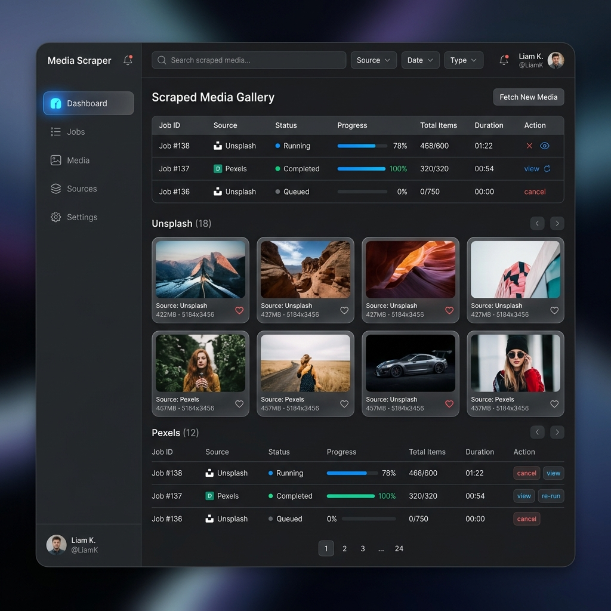
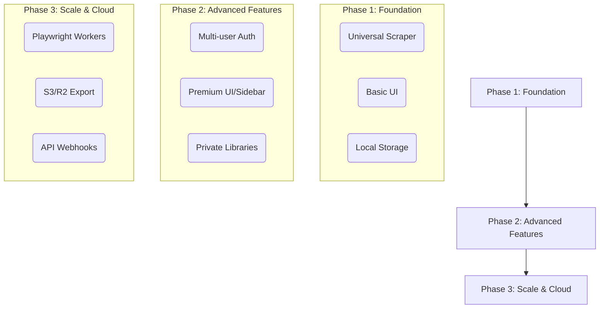

# Media Scraper Platform (Queue + SSE Realtime)


> **Note**: The image above represents the future vision for the dashboard UI. The current implementation is basic and focused on core functionality.

Production-grade media scraping platform optimized for **high submit concurrency**, **controlled worker throughput**, and **large media datasets**—built as a **pnpm + Turborepo monorepo**.

### Supported Media Sources
The scraper is built to handle modern web structures and works seamlessly with famous media-rich sites like:
- **Unsplash** (High-quality photography)
- **Pinterest** (Image discovery)
- **Pexels** (Stock photos and videos)
- **Pixabay** (Free media assets)
- **Instagram** (Public profiles)

### What makes this “production-grade”

- **Queue-first architecture**: API enqueues jobs and returns **202** immediately (no scraping in request lifecycle).
- **Realtime without polling**: **Server-Sent Events (SSE)** with **Redis Pub/Sub** → client updates via **TanStack Query cache patching**.
- **Resource-aware**: designed to run on **1 CPU / 1GB RAM** via bounded concurrency, batching, and conservative timeouts.
- **SSRF-safe scraping**: blocks localhost/private targets, DNS checks in scraper, strict timeouts/redirect limits.
- **Docker-first**: one `docker compose up --build` brings up API, worker, web, Redis, Postgres.
- **Load testing included**: k6 script stresses the queue admission path (not 5000 real websites).

## 🚀 Roadmap



## Architecture

### Data flow (scraping)

```text
Frontend (React)
  ↓
Fastify API (enqueue only → 202 Accepted)
  ↓
Redis + BullMQ Queue
  ↓
Worker Pool (bounded concurrency)
  ↓
Axios + Cheerio scraper
  ↓
PostgreSQL (Prisma)
```

### Realtime flow (status/media updates)

```text
Worker
  ↓ publish minimal events
Redis Pub/Sub (media-scraper:events)
  ↓
Fastify SSE Gateway (/events, /events/jobs/:id)
  ↓
EventSource (browser)
  ↓
TanStack Query cache patch / targeted invalidation
```

See `docs/REALTIME_ARCHITECTURE.md`.

## Quick start (Docker)

```bash
docker compose up -d --build
```

Endpoints:
- **Web**: `http://localhost:5173`
- **API**: `http://localhost:3000`
- **Swagger**: `http://localhost:3000/docs`
- **SSE**: `http://localhost:3000/events`

## One-command automation

This repo includes a script that builds + starts services and runs an SSE smoke test.

### Windows (PowerShell)
```powershell
.\scripts\realtime-up.ps1
```

### macOS / Linux (Bash)
```bash
chmod +x ./scripts/realtime-up.sh
./scripts/realtime-up.sh
```

**Options:**
- Skip builds: `-NoBuild` (or `--no-build` in Bash)
- Skip smoke test: `-NoSmoke` (or `--no-smoke` in Bash)

## Using the UI

The dashboard has three tabs:

- **Submit**: paste URLs (newline or comma-separated) and enqueue scrapes.
- **Jobs**: live job status updates via SSE, view job details and latest media, retry failed jobs.
- **Media**: browse/search/filter/paginate scraped media, export current page to CSV.

## API (selected)

- **Submit jobs**
  - `POST /scrape` → `202 Accepted`
  - body:

```json
{ "urls": ["https://example.com", "https://another.com"] }
```

- **Jobs**
  - `GET /jobs?page=&limit=&status=&search=`
  - `GET /jobs/:id`
  - `POST /jobs/:id/retry` → `202 Accepted`

- **Media**
  - `GET /media?page=&limit=&type=&search=`

- **Realtime**
  - `GET /events`
  - `GET /events/jobs/:id`

- **Ops**
  - `GET /health`
  - `GET /metrics`

## Environment variables

See `.env.example`.

- `DATABASE_URL`
- `REDIS_HOST`
- `REDIS_PORT`
- `API_PORT`
- `WORKER_CONCURRENCY`
- `VITE_API_BASE_URL`

## Load testing (queue admission)

`tests/load/scrape.js` stresses `POST /scrape` to validate stability and backpressure behavior.

```bash
k6 run tests/load/scrape.js
```

## Performance & scaling notes

- **Why queues**: absorbs bursts (e.g., 5000 submits) without blowing up memory/CPU in the API.
- **Bounded concurrency**: worker concurrency is capped (recommended 5–10) to avoid socket/memory storms.
- **Batch DB writes**: inserts are chunked, duplicates skipped at DB constraint boundary.
- **Event-driven UI**: SSE avoids refetch loops and reduces DB/API traffic under many clients.

## Security notes

- SSRF protections (localhost + private IP blocking)
- protocol allowlist (http/https)
- strict timeouts (5s) and redirect limits (3)
- request validation + rate limiting

## Monorepo layout

```text
media-scraper/
  apps/
    api/
    worker/
    web/
  packages/
    db/
    shared/
    scraper/
    config/
  tests/load/
  docs/
  docker/
```

## Engineering Skills Demonstrated

- Distributed systems thinking
- Queue-based architecture
- High concurrency handling
- Backpressure management
- Memory optimization
- Worker orchestration
- SQL schema design + indexing
- API design (async job model)
- Frontend performance optimization
- Event-driven realtime updates (SSE + Pub/Sub)
- Docker/containerization
- Monorepo architecture
- Load testing
- Resiliency engineering + retries
- Production-grade logging and observability hooks
